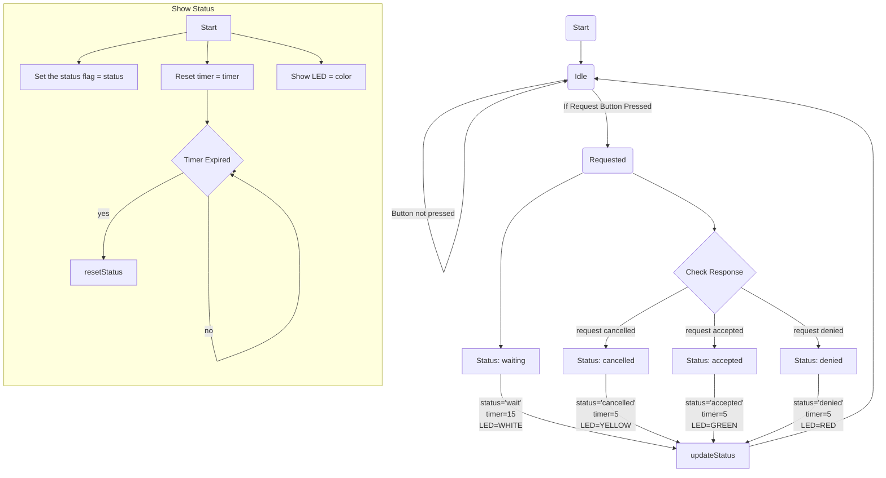

# dndArduino

# State Machine

```mermaid
flowchart TD
    start(Start)
    idle(Idle)

    requested(Requested)
    checkResponse{Check Response}

    showStatusWaiting[Status: waiting]
    showStatusCancelled[Status: cancelled]
    showStatusAccepted[Status: accepted]
    showStatusDenied[Status: denied]

    timerExpire(Timer Expired)

    start --> idle
    idle --> |Button not pressed| idle
    idle --> |If Request Button Pressed| requested
    requested --> showStatusWaiting
    requested --> checkResponse

    checkResponse --> |request accepted| showStatusAccepted
    checkResponse --> |request denied| showStatusDenied
    checkResponse --> |request cancelled| showStatusCancelled

    showStatusWaiting --> |"`status='wait'
    timer=15
    LED=WHITE`" |updateStatus

    showStatusCancelled --> |"`status='cancelled'
    timer=5
    LED=YELLOW`" |updateStatus

    showStatusAccepted --> |"`status='accepted'
    timer=5
    LED=GREEN`" |updateStatus

    showStatusDenied --> |"`status='denied'
    timer=5
    LED=RED`" |updateStatus

    updateStatus --> idle


    subgraph showStatus[Show Status]
    startShowStatus[Start]
    setStatusFlag[Set the status flag = status]
    startTimer[Reset timer = timer]
    setLED[Show LED = color]

    timerExpire --> |yes| resetStatus
    timerExpire --> |no| timerExpire
    startShowStatus --> setStatusFlag & startTimer & setLED
    startTimer --> timerExpire
    end

    showStatus --> timerExpire{Timer Expired}

```
