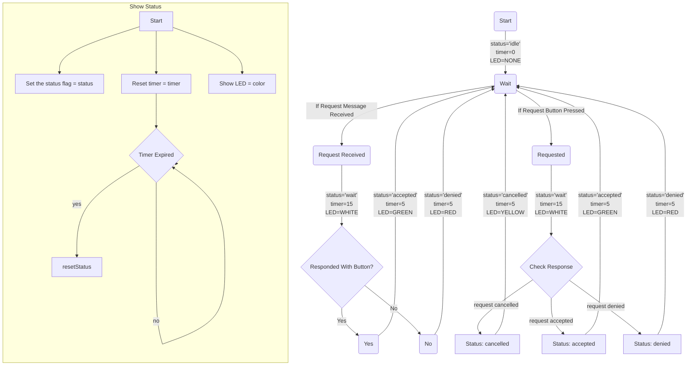

# State Machine

```mermaid
flowchart TD
    start(Start)
    wait(Wait)


    requested(Requested)
    checkResponse{Check Response}

    requestReceived(Request Received)
    waitForResponse{Responded With Button?}
    respondWithYes(Yes)
    respondWithNo(No)

    showStatusCancelled[Status: cancelled]
    showStatusAccepted[Status: accepted]
    showStatusDenied[Status: denied]

    timerExpire(Timer Expired)

    start --> |"`status='idle'
    timer=0
    LED=NONE`" | wait


    wait --> |If Request Button Pressed| requested
    requested --> |"`status='wait'
    timer=15
    LED=WHITE`" | checkResponse

    checkResponse --> |request accepted| showStatusAccepted
    checkResponse --> |request denied| showStatusDenied
    checkResponse --> |request cancelled| showStatusCancelled

    showStatusCancelled --> |"`status='cancelled'
    timer=5
    LED=YELLOW`" |wait

    showStatusAccepted --> |"`status='accepted'
    timer=5
    LED=GREEN`" |wait

    showStatusDenied --> |"`status='denied'
    timer=5
    LED=RED`" |wait

    
    
    wait --> |If Request Message Received| requestReceived
    requestReceived --> |"`status='wait'
    timer=15
    LED=WHITE`" | waitForResponse

    waitForResponse --> |Yes| respondWithYes
    waitForResponse --> |No| respondWithNo

    respondWithYes --> |"`status='accepted'
    timer=5
    LED=GREEN`" |wait

    respondWithNo --> |"`status='denied'
    timer=5
    LED=RED`"|wait


    subgraph showStatus[Show Status]
    startShowStatus[Start]
    setStatusFlag[Set the status flag = status]
    startTimer[Reset timer = timer]
    setLED[Show LED = color]

    timerExpire --> |yes| resetStatus
    timerExpire --> |no| timerExpire
    startShowStatus --> setStatusFlag & startTimer & setLED
    startTimer --> timerExpire
    end

    showStatus --> timerExpire{Timer Expired}

```
