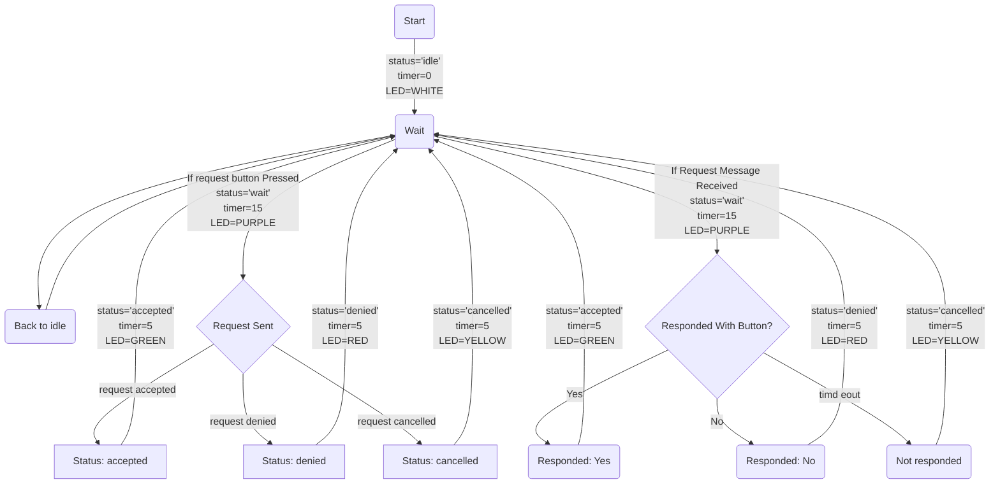

```mermaid

flowchart TD
    state_start(Start)
    state_wait(Wait)
    state_back_to_idle(Back to idle)

    state_request_sent{Request Sent}
    
    state_request_accepted[Status: accepted]
    state_request_denied[Status: denied]
    state_request_timed_out[Status: cancelled]

    state_request_received{Responded With Button?}
    state_responded_with_yes(Responded: Yes)
    state_responded_with_no(Responded: No)
    state_response_timed_out(Not responded)


    state_start --> |"`status='idle'
    timer=0
    LED=WHITE`" | state_wait


    state_wait --> |"`If request button Pressed
    status='wait'
    timer=15
    LED=PURPLE`" | state_request_sent

    state_wait --> state_back_to_idle
    state_back_to_idle --> state_wait

    state_request_sent --> |request accepted| state_request_accepted
    state_request_sent --> |request denied| state_request_denied
    state_request_sent --> |request cancelled| state_request_timed_out

    state_request_accepted --> |"`status='accepted'
    timer=5
    LED=GREEN`" |state_wait

    state_request_denied --> |"`status='denied'
    timer=5
    LED=RED`" |state_wait

    state_request_timed_out --> |"`status='cancelled'
    timer=5
    LED=YELLOW`" |state_wait

    
    
    state_wait --> |"`If Request Message Received
    status='wait'
    timer=15
    LED=PURPLE`" | state_request_received

    state_request_received --> |Yes| state_responded_with_yes
    state_request_received --> |No| state_responded_with_no
    state_request_received --> |timd eout| state_response_timed_out

    state_responded_with_yes --> |"`status='accepted'
    timer=5
    LED=GREEN`" |state_wait

    state_responded_with_no --> |"`status='denied'
    timer=5
    LED=RED`"|state_wait

    state_response_timed_out --> |"`status='cancelled'
    timer=5
    LED=YELLOW`" |state_wait


```